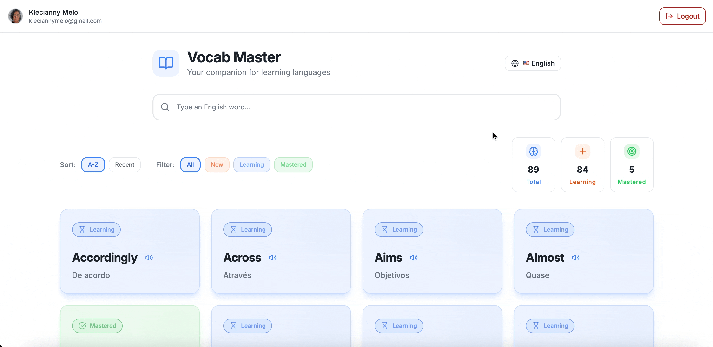
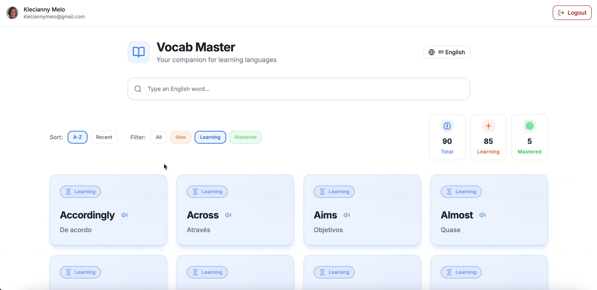
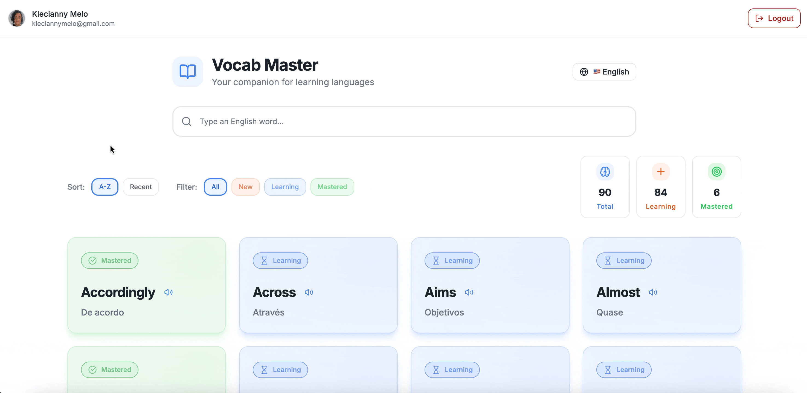

# 📖 Vocab Master

> **Transform your reading into a powerful language learning experience**

[](https://mastervocab.vercel.app)

**Vocab Master** is the ultimate companion for language learners who want to expand their vocabulary while reading books, articles, or any content. Stop interrupting your reading flow to look up words - capture, learn, and master new vocabulary seamlessly.

---

## ✨ Why Choose Vocab Master?

### 🎯 **Smart Learning System**
- **New Words**: Instantly capture unknown words with automatic translation
- **Learning Mode**: Track words you're actively studying with visual progress
- **Mastered Status**: Celebrate your achievements as you master new vocabulary

### 🌍 **Multi-Language Support**
- **English & French**: Full support for both languages
- **Intelligent Translation**: Powered by advanced translation APIs
- **Native Pronunciation**: Built-in text-to-speech for perfect pronunciation

### 📚 **Book-Centric Organization**
- **Reading Progress**: Associate words with specific books you're reading
- **Completed Library**: Track your reading journey and vocabulary growth
- **Smart Categorization**: Organize your learning by source material

### 🎨 **Beautiful & Intuitive Design**
- **Modern UI**: Clean, distraction-free interface designed for focus
- **Visual Feedback**: Color-coded system for instant word status recognition
- **Responsive Design**: Perfect experience on desktop, tablet, and mobile

---

## 🚀 Key Features

### 📝 **Effortless Word Capture**
```
🔍 Search → 🎯 Auto-translate → ✅ Save → 📖 Continue Reading
```
- One-click word addition with automatic Portuguese translation
- Smart duplicate detection
- Instant feedback with beautiful animations

### 📊 **Progress Tracking**
- **Real-time Statistics**: See your vocabulary growth at a glance
- **Learning Analytics**: Track new, learning, and mastered words
- **Book Progress**: Monitor vocabulary per book

### 🎵 **Audio Learning**
- **Perfect Pronunciation**: Native speaker audio for every word
- **Interactive Playback**: Click to hear any word instantly
- **Language-Specific Voices**: Authentic accents for English and French

### 🔄 **Smart Status Management**
- **Dynamic Filtering**: View words by status (New, Learning, Mastered)
- **One-Click Updates**: Easily move words between learning stages
- **Visual Indicators**: Intuitive icons and colors for each status

### 🌐 **Seamless Language Switching**
- **Instant Toggle**: Switch between English and French learning
- **Separate Vocabularies**: Maintain distinct word lists per language
- **Unified Experience**: Consistent interface across all languages

---

## 🎬 See It In Action

### 📚 **Add new words and watch the magic happen**
*Instant word capture with automatic translation*



### 🎮 **Turn your learning into a game**
*Interactive interface for vocabulary editing and management*



### 🔎 **Find any word in seconds**
*Advanced filtering system to locate words quickly*



### 🗣️ **Listen and learn from a native speaker**
*Authentic pronunciation with native voices*

<video src="https://raw.githubusercontent.com/Kecbm/vocab-master/main/public/videos/4.pronuciation.mp4" controls="controls" width="100%">
  Your browser does not support the video tag.
</video>

---

## 🛠️ Technology Stack

**Frontend Excellence:**
- ⚛️ **React 18** - Modern, performant UI
- 🎨 **Tailwind CSS** - Beautiful, responsive design
- 🔧 **TypeScript** - Type-safe development
- 🎭 **Framer Motion** - Smooth animations

**Backend Power:**
- 🔥 **Firebase** - Real-time database and authentication
- 🌐 **Translation APIs** - Accurate, instant translations
- 🔊 **Web Speech API** - Native pronunciation support

**Developer Experience:**
- ⚡ **Vite** - Lightning-fast development
- 📦 **Modern Tooling** - ESLint, Prettier, TypeScript
- 🚀 **Vercel Deployment** - Instant, global distribution

---

## 🚀 Quick Start

### 1. **Try the Live Demo**
Experience Vocab Master instantly: [mastervocab.vercel.app](https://mastervocab.vercel.app)

### 3. **Start Learning**
1. 🔍 Search for any English or French word
2. ✅ Save it to your vocabulary
3. 📖 Continue reading and learning
4. 🎯 Track your progress as you master new words

---

## 🎯 Perfect For

### 📚 **Book Lovers**
Transform your reading hobby into a language learning superpower

### 🎓 **Language Students**
Supplement your formal studies with practical vocabulary building

### 💼 **Professionals**
Expand your business vocabulary while reading industry content

### 🌍 **Travel Enthusiasts**
Prepare for your next adventure with essential vocabulary

---

## 🤝 Contributing

We welcome contributions! Whether it's:
- 🐛 Bug fixes
- ✨ New features
- 📝 Documentation improvements
- 🌍 Translation additions

Check out our [Contributing Guide](CONTRIBUTING.md) to get started.

---

## 👨‍💻 Created By

**Klecianny Melo**
- 💼 [LinkedIn](https://linkedin.com/in/Kecbm)
- 🐙 [GitHub](https://github.com/Kecbm)
- 🐦 [Twitter](https://twitter.com/Kecbm)
- 📝 [Dev.to](https://dev.to/Kecbm)

---

<div align="center">

### 🚀 Ready to Transform Your Language Learning?

[](https://mastervocab.vercel.app)

**Don't let unknown words slow down your reading. Start building your vocabulary today!**

</div>

